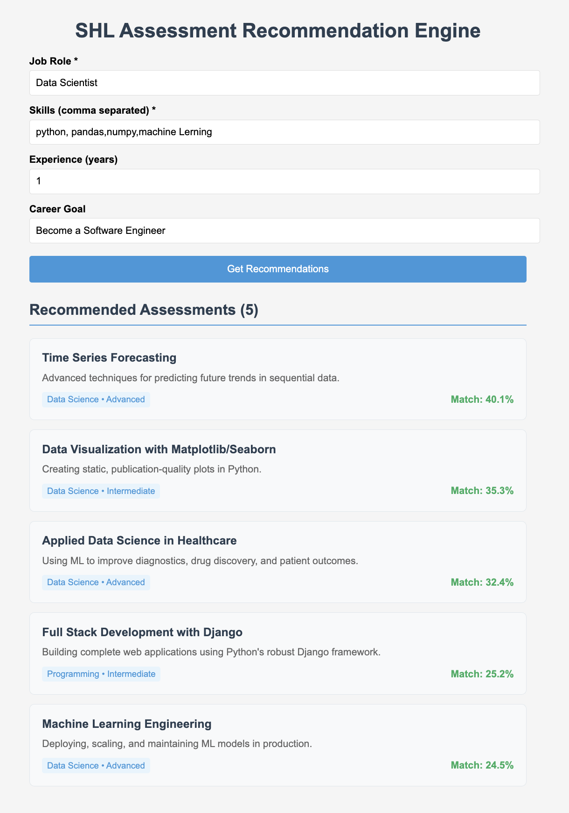

# SHL Recommendation Engine

This project is a recommendation engine for SHL assessments, containing both **backend** and **frontend**. You can run it locally for testing.



---

## Project Structure

shl-recommendation-engine/
├── backend/ # Python backend (Flask/FastAPI)
├── frontend/ # Next.js frontend
├── README.md
├── docker-compose.yml
└── .gitignore

yaml
Copy code

---

## Getting Started (Local Setup)

### 1. Clone the repository

```bash
git clone https://github.com/sumitnegii/shl-recommendation-engine.git
cd shl-recommendation-engine
2. Backend Setup
Go to backend folder:

bash
Copy code
cd backend
Create a virtual environment (optional but recommended):

bash
Copy code
python3 -m venv venv
source venv/bin/activate   # Mac/Linux
venv\Scripts\activate      # Windows
Install dependencies:

bash
Copy code
pip install -r requirements.txt
Run the backend:

bash
Copy code
python app.py
Backend will run on default port (usually http://localhost:5000).

3. Frontend Setup
Go to frontend folder:

bash
Copy code
cd frontend
Install dependencies:

bash
Copy code
npm install
Run the frontend:

bash
Copy code
npm run dev
Frontend will run on http://localhost:3000.


